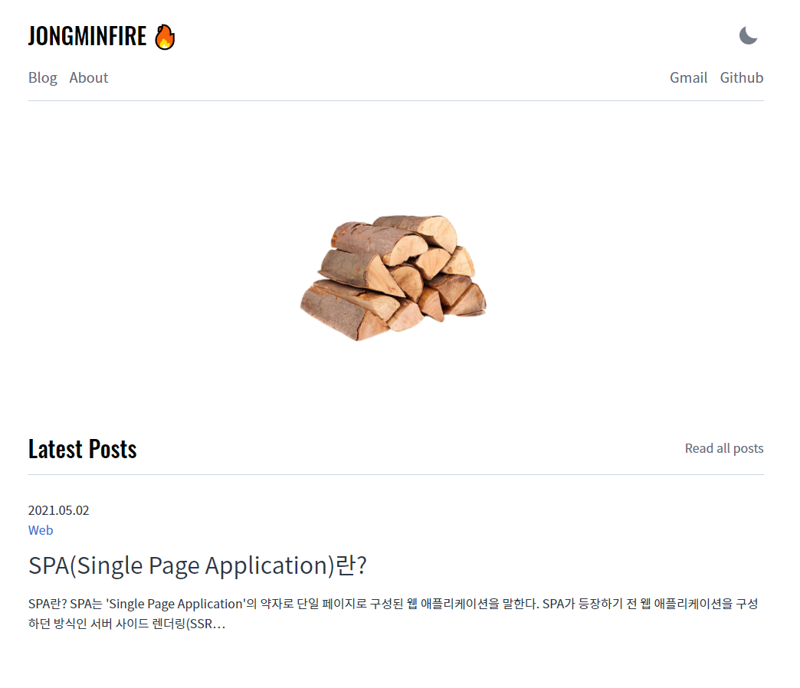

# JONGMINFIRE.dev 🔥
 
 

### [구경하기 👀](https://jongminfire.dev)

 

 

### 무엇을 작성하나요? ✍️

 

관심 있는 분야에 관해서 공부한 뒤, 공부한 내용을 정리해 작성합니다.  
가장 관심이 있는 프론트엔드 관련 기술 이외에도 흥미가 생기는 분야는 가리지 않고 작성합니다.  

다른 개발 블로그를 참고하며 많은 도움을 받았던 경험으로, 누군가에게 도움이 되었으면 하는 마음에서 시작하게 되었습니다.

 

### 최근 게시글 📚

 

<!-- BLOG-POST-LIST:START -->[SPA(Single Page Application)란?](https://jongminfire.dev/spa-single-page-application-란) $randomEmoji (Sun May 02 2021 12:00 AM)[TypeScript의 유틸리티 타입](https://jongminfire.dev/type-script의-유틸리티-타입) $randomEmoji (Wed Apr 21 2021 12:00 AM)[파이썬 enumerate() & zip()](https://jongminfire.dev/파이썬-enumerate-zip) $randomEmoji (Tue Apr 13 2021 12:00 AM)[CSS-in-JS](https://jongminfire.dev/css-in-js) $randomEmoji (Sun Apr 04 2021 12:00 AM)[OSI 7 계층](https://jongminfire.dev/osi-7-계층) $randomEmoji (Thu Mar 25 2021 12:00 AM)<!-- BLOG-POST-LIST:END -->

 

Theme by [LekoArts - Gatsby-starter-minimal-blog](https://github.com/LekoArts/gatsby-starter-minimal-blog)

