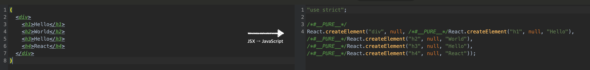

React를 공부하다보면 JSX 라는 문법을 많이 들어보게 된다. React에서 JSX 사용은 필수가 아니지만, 많은 사람들이 UI를 구성하기 더 쉬운 JSX 문법을 선호한다.

그렇다면 JSX란 무엇일까?

<br />

##### JSX란?

<br />

```js
const element = <h1>Hello, World!</h1>;
```

<br />

JSX를 접해보지 않았다면 위 문법은 특이하게 느껴질 수 있다. HTML처럼 생겨 HTML으로 생각하기 쉽지만 이 코드는 JavaScript 코드이다.

이 문법은 JavaScript를 확장한 JSX라는 문법이다. JSX는 JavaScript XML이라는 이름에 맞게 XML 형태로 작성된다.

<br />

---

<br />

##### JSX를 왜 사용할까?

<br />

그렇다면 많은 React 개발자들은 왜 JSX를 사용할까? 먼저 JSX를 사용한 코드와 그렇지 않은 코드를 비교해본다.

```js
class Example extends React.Component {
	render() {
		return <div>Hello World</div>;
	}
}
```

<br />

먼저 JSX를 사용한 코드이다. 페이지 렌더를 담당하는 render 함수의 반환 값을 XML 형식으로 알기 쉽게 표현 할 수 있다.

이러한 코드를 JSX를 사용하지 않고 구성하려면 `React.createElement(component,props,...children)`을 호출해야 한다.

<br />

```js
class Example extends React.Component {
	render() {
		return React.createElement("div", null, "Hello World");
	}
}
```

<br />

두 코드를 비교해보면 JSX로 작성된 return 값은 요소가 가지는 내용과 위치를 쉽게 유추할 수 있지만 JSX 없이 작성된 코드는 유추하기 어렵다. 이 예제는 단 하나의 요소만 다루지만 render되어야 하는 요소가 많아질 경우 JSX를 사용하지 않는다면 코드를 파악하기 매우 어려워질 것 이다.

이와같이 JSX는 **표현력이 뛰어나 코드를 더 읽기 쉽게 만들고, XML과 문법이 유사하여 중첩된 선언형 구조를 더 잘 나타내는 장점**이 있다.

<br />

---

<br />

##### JSX를 사용하기 위한 문법

<br />

JSX를 사용하기 위해서는 몇가지 문법을 지켜야한다.

<br />

###### 1. JSX 요소는 감싸져 있어야 한다

JSX 내부에 여러 요소가 있을 경우 반드시 부모 요소로 감싸야한다.

<br />

```js
return {
    <h1>Hello</h1>
    <h2>World</h2>
    <h3>Hello</h3>
    <h4>React</h4>
}
```

예를 들어 위와 같은 요소를 반환하기 위해서는 `h1`,`h2`,`h3`,`h4` 태그를 모두 감싸는 부모 요소가 필요하다.

```js
return {
    <>
        <h1>Hello</h1>
        <h2>World</h2>
        <h3>Hello</h3>
        <h4>React</h4>
    </>
}
```

<br />

React에서는 위와 같이 부모 요소로 감싸기 위한 `<React.Fragment>` 태그 혹은 `<>` (빈 태그)를 사용한다.

<br />

###### 2. 자바스크립트 값은 중괄호로 감싼다

<br />

```js
const name = "Jongminfire";

return {
    <>
        <div>제 이름은 {name} 입니다.</div>
    </>
}
```

JSX 내부에 자바스크립트 변수를 보여줘야 할 때는 `{}` 로 감싸야 한다.

<br />

###### 3. class와 style 정의

JSX에서는 class와 style 정의에서도 차이가 있다.

```js
return {
    <div className="example"></div>
}
```

먼저 HTML에서 class를 정의하기 위해선 `<div class="example"></div>` 형식으로 정의 할 수 있었지만, JSX에서는 class 대신 <b><u>className</u></b> 을 사용한다.

또한 style을 정의할 때도 차이가 있다. 인라인 스타일의 경우 `-`으로 사용하던 이름을 camelCase 형태로 바꿔야 하고, 각 css 속성 뒤에는 세미콜론 (`;`) 대신 쉼표 (`,`)를 사용한다.

<br />

```js
const example = {
	display: "flex",
	justifyContent: "center",
	alignItems: "center",
	backgroundColor: "black",
	fontSize: "16px",
};

return {
    <div style={example}></div>
}
```

<br />

---

<br />

##### 바벨(babel)이란?

<br />

React에서 JSX를 사용할 수 있게 JSX를 JavaScript로 변환하는 역할을 하는 것이 **바벨 (babel)**이다.

<center>



</center>

Babel은 위처럼 JSX로 작성된 코드를 JavaScript로 바꿔 브라우저에서 실행되도록 변환해주는 컴파일러 도구이다.

뿐만 아니라 ES6 이후로 새롭게 생긴 문법들을 지원하지 않는 구형 브라우저에서도 원활하게 작동 할 수 있도록, ES6 문법을 ES5 문법으로 바꿔주기도 한다.

[바벨 공식 홈페이지](https://bit.ly/2wMpkk2)에서 Babel이 JSX 코드를 어떻게 JavaScript 코드로 바꾸는지 확인 할 수 있다.

<br />

---

<br />

#### 참고

-   [React 공식문서 - JSX 소개](https://ko.reactjs.org/docs/introducing-jsx.html#gatsby-focus-wrapper)
-   [velopert님 - React Tutorial, JSX의 기본 규칙 알아보기](https://react.vlpt.us/basic/04-jsx.html)
-   [babel 공식 홈페이지](https://babeljs.io/)
