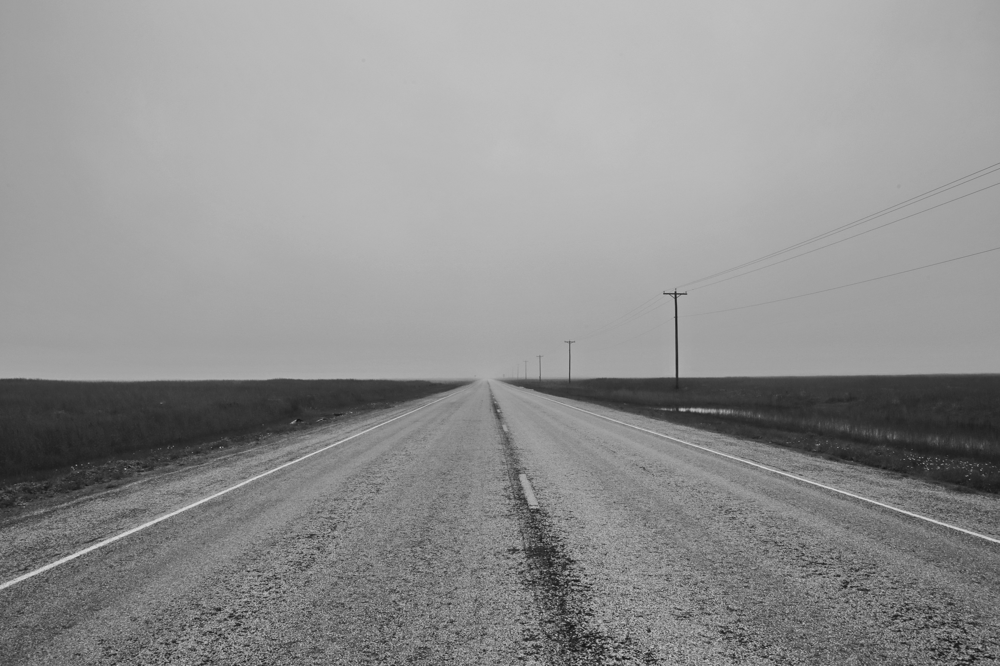
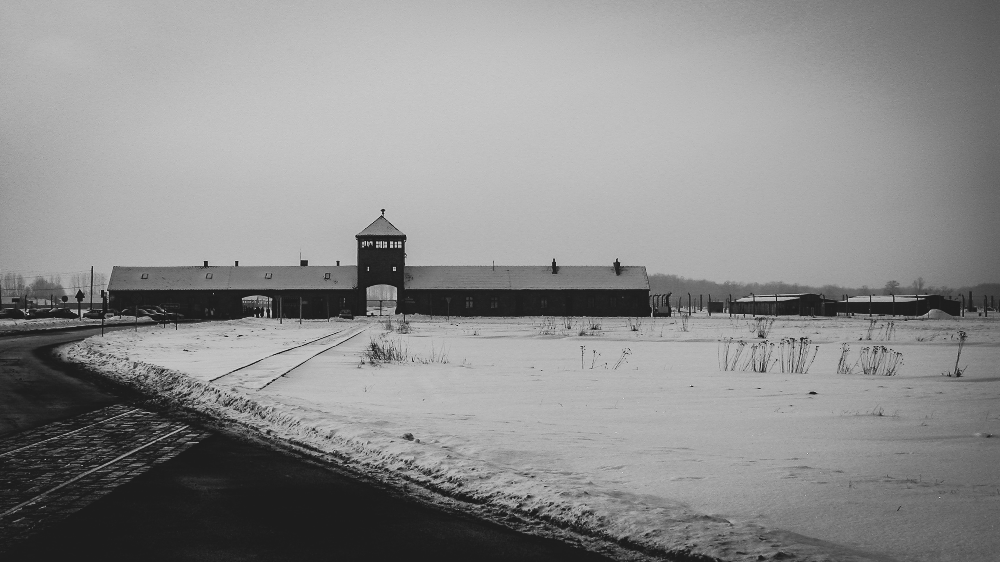

입사 1년 5개월 차에 번아웃이 왔다.

- 일에 대한 의욕이 도저히 생기지 않고 프로젝트에 관심이 멀어져간다.
- 퇴근 시간 한참 전부터 1분, 2분 세며 경계 근무 같은 억겁의 시간이 지나가길 바란다.
- 출 퇴근길 다른 사람들을 보면 나만 다른 세상에 놓여있는 것 같다. 웃음기 하나 없는 흑백의 세상

1년 5개월 동안 성취와 보람의 무한한 사이클을 돌며 나름 열심히 했다. 몸을 혹사하기도 하면서 프로젝트를 끝내고 다시 재충전 할 시간 없이 다시 달렸다. 그럼에도 회사의 상황이 점점 좋아지지 않았고 급해져가는 회사의 결정에 따라 일을 하는 것은 스트레스로 다가왔다. 

이 때까지는 가벼운 감기 기운처럼 잠시 스쳐가는 스트레스일 줄 알았고 회사도 나도 당연히 회복할 거라는 생각이었다.

그러던 중 정리 해고에 대한 공지가 있었다. 같이 일하던 동료들의 절반 정도가 하루 아침에 회사에서 나가게 됐다. 안타까움과 미안함 속에 동료들과 명함을 교환하며 마지막 인사를 건냈고 그 주간은 아무 일도 손에 잡히지 않았다. “너는 그래도 살아남았네” 라는 주변인의 말을 들을 때면 마치 내가 재해 현장이나 전쟁터 속 생존자가 된 것처럼 느껴지곤 했다.

 

*아무리 사회 생활은 전쟁이라지만 정말 전쟁터처럼 느껴져도 괜찮은 건가요?*

 

어려워지는 회사 상황 속에서 내가 할 수 있는 게 없다는 것은 큰 무력감으로 다가왔다. 혹시나 다시 한번 정리해고가 진행될 때 회사의 결정에 따라 자리가 없어질 수도 있는 그런 위치에 있다는 것이다. 다시 한번 사춘기가 찾아온 것 같이 정서적으로 불안해지고 감정에 휩쓸려서 판단하는 일이 많아졌다. 이미 스트레스로 가득 찬 머릿속에 나쁜 상황들이 몰려와 범벅이 된다.

감기 기운인 줄 알았던 스트레스는 어느 새 독감이 되어있었다.

일주일 동안 회사를 쉬어가게 되었다. 같은 팀원이 *죽음의 수용소에서* 라는 책을 추천해줬고, 독서를 안 좋아하는 나지만 어디에도 의지 할 수 있다면 좋겠다 싶어서 책을 읽게 됐다. 

정신과 의사인 빅토르 프랑클 작가는 아우슈비츠 수용소에 수감되어 육체 노동과 폭력, 당장 내일 죽을 수도 있다는 심리적인 압박 속에 자신과 수감자들의 정신 상태에 대해 집중하며 **비극속의 낙관** 이라는 책의 주제를 관통하는 구절을 통해 비극을 맞이 했을 때 평범한 환경에서 도달할 수 없는 위대한 성취와 자신을 초월할 수 있는 기회를 얻을 수 있음을 강조한다.

 

> 사람이 자기 운명과 그에 따르는 시련을 받아들이는 과정, 다시 말해 십자가를 짊어지고 나아가는 과정은 그 사람으로 하여금 자기 삶에 보다 깊은 의미를 부여할 있는 폭넓은 기회를 제공한다. 그 삶은 용감하고, 품위 있고 헌신적인 것이 될 수 있다.

 

나의 힘듦은 책에서 나온 비극과 비교했을 때 너무나 사소한 것이었다. 뿌옇던 생각이 정리되면서 낙관을 찾을 수 있을 것만 같았다.

 

---

 

###### 내 삶을 살자

번아웃이 오기 전까지의 내 삶에선 회사와 일에 대한 비중이 컸다. 단순히 가장 많은 시간을 보내는 곳이라서가 아니라 평소에 하는 생각과 신경이 일에 쏠려 있었다. 내 신경과 에너지를 쏟은 만큼 회사 사정이 어려워짐에 번아웃이 오는 것은 자연스러운 일인 것 같기도 하다.

회사가 안 좋아지는 것은 언제든지 일어날 수 있는 일이고 내가 컨트롤 하기 힘든 영역이다. 엔데믹 이후 나빠지고 있는 시장 상황을 막을 수도 없고 회사의 전략을 바꿀 수도 없다. 회사가 흔들리더라도 나는 흔들릴 필요가 없다.

일을 더 완벽하게 하기 위한 욕심도 많았다. 더 많은 것들을 내가 만족하는 만큼 잘하고 싶어 시간과 나를 갈아서 일을 했다. 빨리 가려고 애쓰다 보니 내 발에 걸려 내가 넘어졌다. *죽음의 수용소에서* 책 맨 앞장의 서문에서부터 작가는 내 머리를 때렸다.

 

> 성공을 목표로 삼지 말라. 성공을 목표로 삼고 그것을 표적으로 하면 할 수록 그것으로부터 더 멀어질 뿐이며 성공과 행복은 잊어버리고 있을 때 나에게 찾아온다.

 

지속적으로 일하기 위해서 내가 건강하게 생활할 수 있는 환경을 만들어야 한다. 일도 주변인도 아닌 내가 주체가 되는 삶을 살아야 한다.

 

###### 힘듦을 맞이하자

예상하지 못한 힘든 순간들은 갑자기 찾아온다. 잔잔한 강처럼 살 수 있으면 좋으련만 어려운 상황들이 파도처럼 밀려온다. 이런 상황들은 나를 절망하도록 이끌기도 하지만 시간이 지나고 보면 왜 그렇게까지 힘들어했을까 생각하게 만든다.

이번에 가장 크게 느낀 것은 안 좋은 상황들이 왔을 때 그 상황들을 맞이하는 사고를 달리해야 한다는 것이다. 힘듦을 맞이할 준비가 되어 있다면 그것은 나를 잠깐 끌어내렸다가도 더 단단하게 만들어 줄 것이다.

 

---

 

번아웃을 극복하는 여러 방법이 있겠지만 일을 잠시 쉬면서 생각을 정리할 시간을 갖는 것이 큰 도움이 되었다.

긴 휴가가 끝나는 날이다. 독감이 지나가듯 번아웃도 희미해져 가고 있다.

 

*+ 독서를 자주 해야겠다. 앞으로는 블로그도 더..*