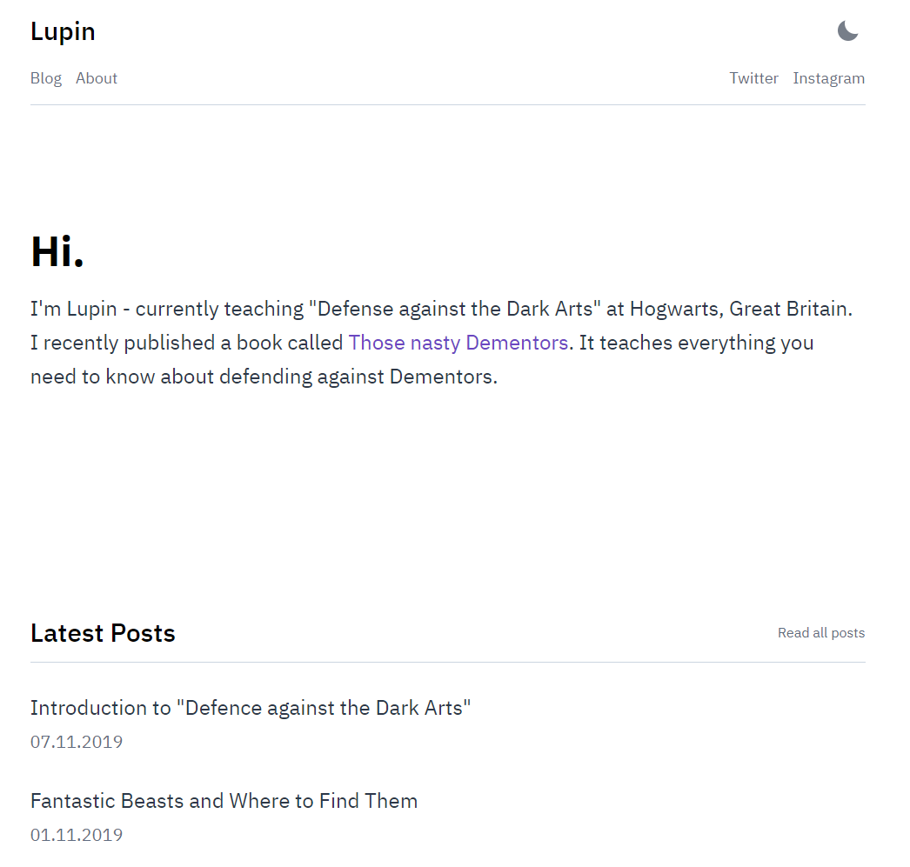

미루고 미루다 블로그를 만들게 되었다.

첫 포스트로 블로그에 대한 두서없는 글을 작성해보려 한다.

 

> #### 블로그를 왜 시작했지?

 

가장 큰 이유는 역시나 블로그를 포트폴리오로 활용할 수 있다는 점이다. 예전부터 공부한 내용을 마크다운으로 작성해서 깃허브에 올리곤 했는데, 이왕 그렇게 공부하는 거 여러 저장소에 분산시켜 놓을 바에 블로그에 묶어 놓으면 포트폴리오로써 활용하기 좋다고 생각했다.

 

두번째로는 정돈된 글로 작성할 때 내용을 더 자세하고 깔끔하게 알게 되기 때문이다. 블로그에 글을 작성할 때는 사소하고 작은 부분이라도 넘기면서 공부할 수가 없다. 잘 정돈 된 깔끔한 글로 정리하면서 공부할 때가 그렇지 않을 때보다 기억에 오래 남기도 하고, 작성한 내용에 대해 말로 표현할 때 능숙하게 말할 수 있었다. 습관을 들이면 나중에 면접을 볼 기회가 생겼을 때 많은 도움이 되지 않을까?

 

마지막으로는 기술에 관한 내용 이외에도 내가 관심 있는 것들을 글로 기록하고 싶기 때문이다. 개발자 블로그라 해도 개인 블로그이기 때문에 내 관심사로 공간을 채우고 싶다. 반대로 개발에 관한 내용일지라도 관심사에서 벗어난다면 억지로 작성하고 싶지 않다.

 

> #### 어떤 기술로 만들었는가

 

`Gatsby` 라는 정적 웹사이트 프레임워크를 추천받아서 만들게 되었다. `Gatsby` 를 고르게 된 이유는 React를 이용한 프레임워크이기 때문인데, React가 익숙한 나로서는 커스텀하기도 편하고 익숙할 것 같아 별다른 고민을 하지 않고 `Gatsby`를 선택했다.

테마로는 <a href ="https://github.com/LekoArts/gatsby-starter-minimal-blog">gatsby-starter-minimal-blog</a> 를 골랐다. 간단해서 마음에 든다.

 

웹 사이트 배포는 `Netlify`를 통해서 진행했다. 이전에 소융봇 웹 페이지를 배포해본 경험이 있어서 쉽게 할 수 있을 줄 알았는데, 블로그 커스텀 반영이 안 돼서 하루 넘게 씨름을 하고 보니 `Netlify` 빌드 경로를 잘못 설정하는 실수를 한 걸 발견했다. 🤯

 

블로그를 만들 때에 https://juneyr.dev/jekyll-to-gatsby-%EB%B8%94%EB%A1%9C%EA%B7%B8-%F0%9F%91%A9%E2%80%8D%F0%9F%94%A7 글에서 많은 도움을 얻을 수 있었다.

 

> #### 앞으로의 계획

 

당연히 꾸준히 글을 작성하는 목표가 있고, 무엇을 중점으로 공부할지 정하지는 않았기 때문에 가까운 계획으로 예전에 공부했던 내용을 블로그에 옮기는 작업부터 하려고 한다. 

